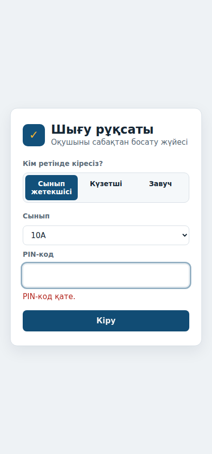
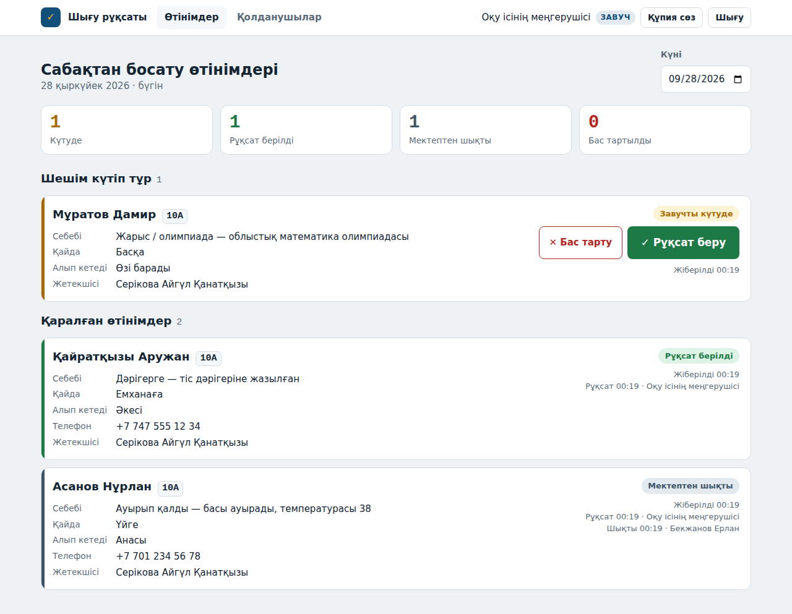
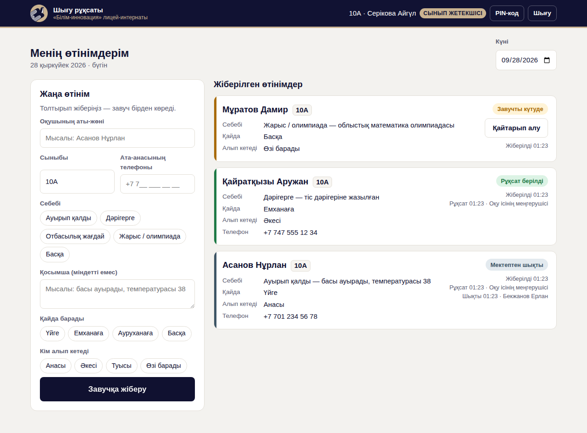
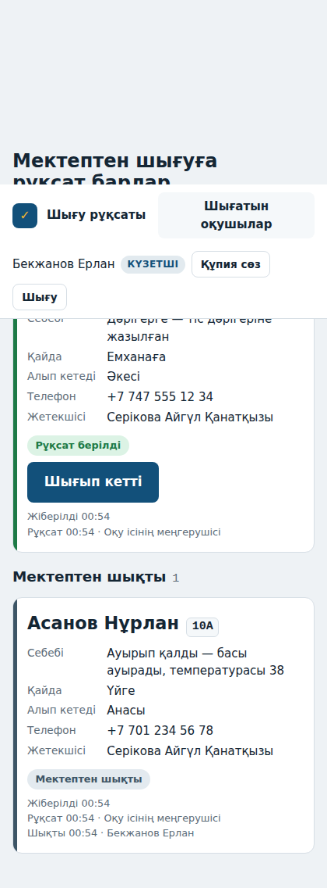
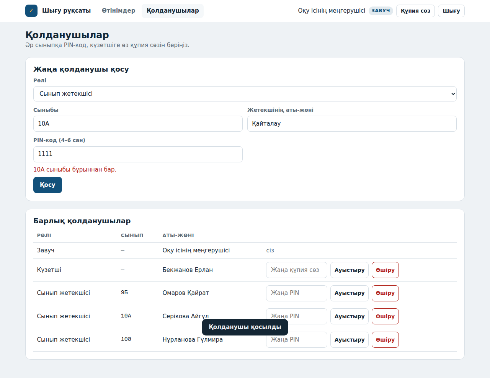
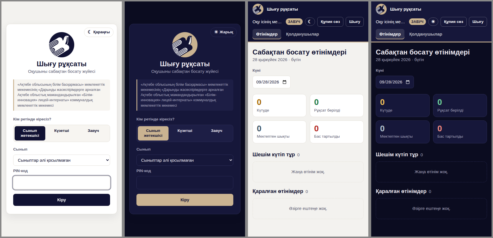

# Шығу рұқсаты: оқушыны сабақтан босату жүйесі

«Ақтөбе облысының білім басқармасы» мемлекеттік мекемесінің «Дарынды жасөспірімдерге арналған Ақтөбе облыстық мамандандырылған «Білім-инновация» лицей-интернаты» коммуналдық мемлекеттік мекемесі

Оқушы сабақ кезінде ауырып қалса немесе үйге кетуі керек болса, енді завучқа қоңырау шалудың қажеті жоқ.

1. **Сынып жетекшісі** өз сыныбын таңдап (мысалы 10А), PIN-кодпен кіреді де, оқушының аты-жөнін, сыныбын, себебін, қайда баратынын және кім алып кететінін жазады.
2. **Завуч** өтінімді көреді (бет 10 секунд сайын жаңарады, жаңа өтінім келгенде дыбыс шығады) және **✓ Рұқсат беру** немесе **✕ Бас тарту** басады.
3. **Күзетші** тек рұқсат берілген оқушыларды көреді. Оқушы шыққанда **«Шығып кетті»** басады, сол кезде уақыты жазылып қалады.

Барлық деректер **Google Sheets** кестесінде сақталады, ал сайттың өзі **Google Apps Script** арқылы тегін жұмыс істейді. Завуч кестені ашып, барлық өтінімдерді көре алады, сүзгіден өткізіп, басып шығара алады.

| Кіру | Завуч | Сынып жетекшісі | Күзетші (телефон) |
|---|---|---|---|
|  |  |  |  |

## Кім қалай кіреді

Логин жазудың қажеті жоқ. Кіру бетінде алдымен рөлді таңдайсыз:

| Кім | Қалай кіреді |
|---|---|
| **Сынып жетекшісі** | Сыныпты тізімнен таңдайды (10А, 10Ә, 9Б …) және сол сыныптың **PIN-кодын** (4–6 сан) енгізеді. Әр сыныптың өз PIN-коды бар. |
| **Күзетші** | Өз **құпия сөзін** енгізеді. |
| **Завуч** | Өз **құпия сөзін** енгізеді. |

Телефон соңғы таңдалған рөл мен сыныпты есте сақтайды, сондықтан келесі жолы тек PIN-код енгізсе болғаны. Бір сыныпқа 10 рет қате PIN енгізілсе, сол сыныптан кіру 10 минутқа бұғатталады.

Сыныптарды, PIN-кодтарды және күзетшінің құпия сөзін завуч **«Қолданушылар»** бетінде қосады және ауыстырады.

## Орнату (15 минут)

Мұны мектептің Google аккаунтымен бір рет жасау керек. Сайт осы аккаунттың атынан жұмыс істейді.

### 1. Кесте жасау

1. [sheets.new](https://sheets.new) ашып, жаңа кесте жасаңыз. Атауын қойыңыз, мысалы «Шығу рұқсаты».
2. Мәзірден **Кеңейтімдер → Apps Script** (Extensions → Apps Script) ашыңыз.

### 2. Кодты көшіру

Apps Script редакторында [`apps-script`](apps-script) бумасындағы 7 файлды көшіріңіз:

| Файл | Не істеу керек |
|---|---|
| `Code.gs` | Бар `Code.gs` ішіндегінің бәрін өшіріп, осы файлды қойыңыз. |
| `Index.html` | **+ → HTML** басып, `Index` деп атаңыз (`.html` жазбаңыз), ішіне қойыңыз. |
| `Styles.html` | Дәл солай, атауы `Styles`. |
| `Script.html` | Дәл солай, атауы `Script`. |
| `LogoNavy.html` | Дәл солай, атауы `LogoNavy`. Ішінде қою көк логотип суреті бір ұзын жол болып жазылған, оны толық көшіріңіз. |
| `LogoSand.html` | Дәл солай, атауы `LogoSand` (құм түсті логотип). |
| `appsscript.json` | ⚙️ **Жоба параметрлері** → «Show appsscript.json» белгілеңіз. Сосын файлдың ішіндегісін ауыстырыңыз. |

**💾 Сақтау** басыңыз.

### 3. Кестені баптау

1. Редактордың жоғарғы жағынан `setup` функциясын таңдап, **▶ Іске қосу** (Run) басыңыз.
2. Google рұқсат сұрайды: аккаунтты таңдап, **Advanced → Go to … (unsafe) → Allow** басыңыз. Бұл сіздің өз скриптіңіз, қауіпсіз.
3. Кестеде үш парақ пайда болады: `Қолданушылар`, `Өтінімдер` және жасырын `Сессиялар`.

### 4. Сайтты жариялау

1. **Deploy → New deployment** басыңыз, ⚙️ түрі ретінде **Web app** таңдаңыз.
2. **Execute as:** *Me*, **Who has access:** *Anyone*.
3. **Deploy** басыңыз. Шыққан `https://script.google.com/macros/s/…/exec` сілтемесі сіздің сайтыңыз. Оны мұғалімдер мен күзетшіге жіберіңіз (телефонның басты экранына қосып қоюға болады).

### 5. Бірінші кіру

Кіру бетінде **Завуч** таңдап, `zavuch123` құпия сөзін енгізіңіз.

**Кіргеннен кейін құпия сөзді бірден ауыстырыңыз** (жоғарғы оң жақтағы «Құпия сөз» батырмасы). Содан кейін **«Қолданушылар»** бетінде:

- әр сыныпты қосыңыз: сыныбы (10А), жетекшінің аты-жөні, PIN-код;
- күзетшіні қосыңыз: аты-жөні және құпия сөзі.

PIN-кодтарды жетекшілерге жеке-жеке беріңіз. Жетекші өз PIN-кодын кейін «PIN-код» батырмасы арқылы өзі ауыстыра алады.

## Брендбук

Сайт «Білім-инновация» брендбугы бойынша безендірілген:

- **Түстер:** қою көк `#111233` және құм түсті `#CAB391`.
- **Қаріп:** SF Pro Display (iPhone мен Mac-та бар), басқа құрылғыларда оған ұқсас Inter.
- **Логотип:** брендбуктағы дөңгелек логотиптің екі түсі де бар: қою көк (`LogoNavy.html`) және құм түсті (`LogoSand.html`). Олар сайттың ішінде сурет ретінде сақталған, сондықтан сайт Drive-қа тәуелді емес.
- **Екі режим:** жарық және қараңғы. Әдепкіде телефонның баптауына сай ашылады, ал ☾ / ☀ батырмасымен қолмен ауыстыруға болады. Таңдалған режим сол құрылғыда есте қалады. Жарық режимде кіру бетінде қою көк логотип, қараңғы режимде құм түсті логотип көрінеді.

 Браузер қойындысындағы белгі ғана Drive-тағы логотип файлынан алынады (`FAVICON_URL`).

## Мектеп атауын өзгерту

Атау `Code.gs` файлының басында тұр: `SCHOOL_FULL_NAME` (кіру бетінде көрінеді), `SCHOOL_SHORT_NAME` (жоғарғы жолақта) және `SITE_TITLE` (браузер қойындысында). Өзгерткеннен кейін жаңа нұсқаны жариялаңыз (төменде қараңыз).

## Кодты жаңарту

Кодты өзгерткеннен кейін **Deploy → Manage deployments → ✏️ → Version: New version → Deploy** басыңыз. Сілтеме сол күйі қалады.

## Кестедегі деректер туралы

- `Өтінімдер` парағында әр өтінім бір жол болады: күні, оқушы, себебі, кім рұқсат берді, қашан шықты. Бұл параққа қолмен жол қоспаңыз және бағандардың ретін өзгертпеңіз.
- `Қолданушылар` парағында PIN-кодтар мен құпия сөздер ашық түрде емес, шифрланған (хэш) түрде сақталады. Сондықтан ұмытылған PIN-ді кестеден көруге болмайды, завуч сайт арқылы жаңасын береді.
- Кестені тек завуч пен әкімшілікпен бөлісіңіз. Сайтты пайдалану үшін кестеге қол жеткізу керек емес.
